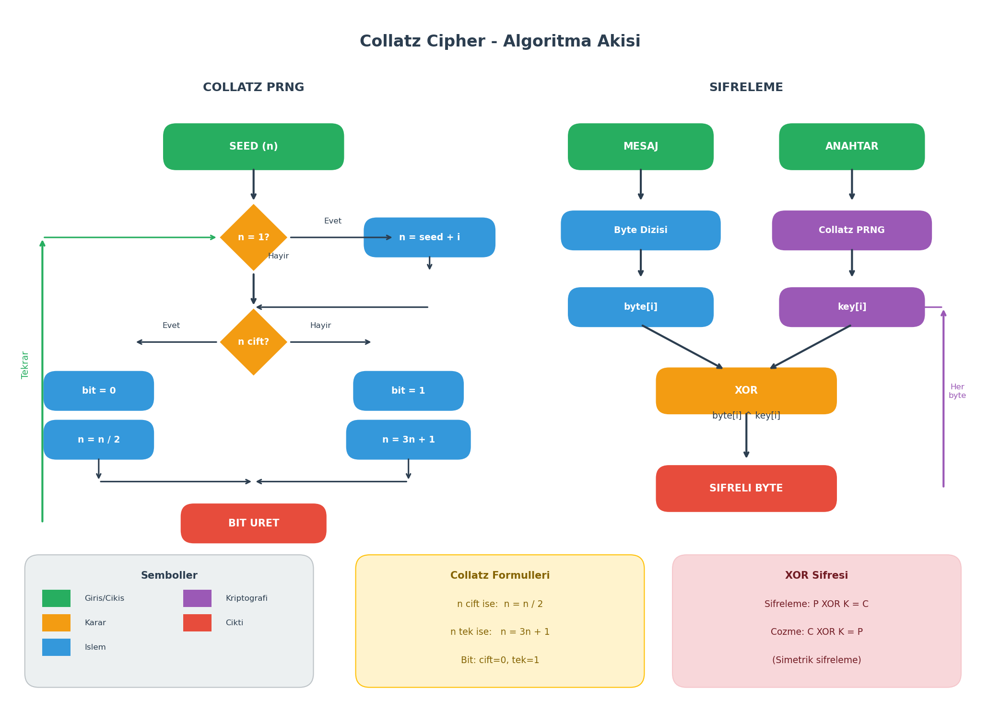
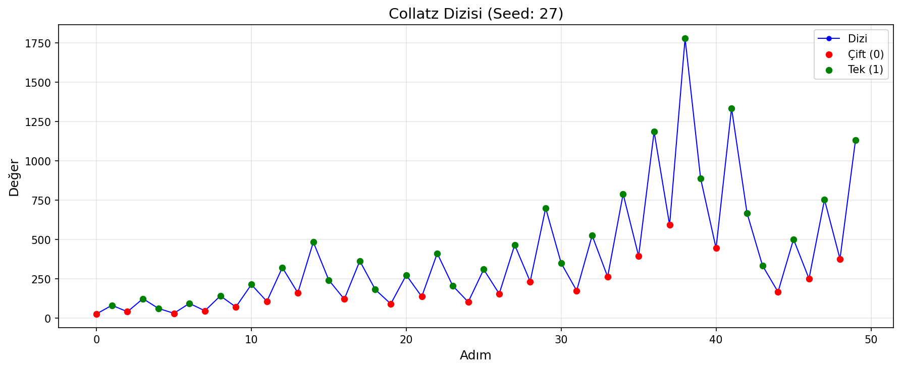
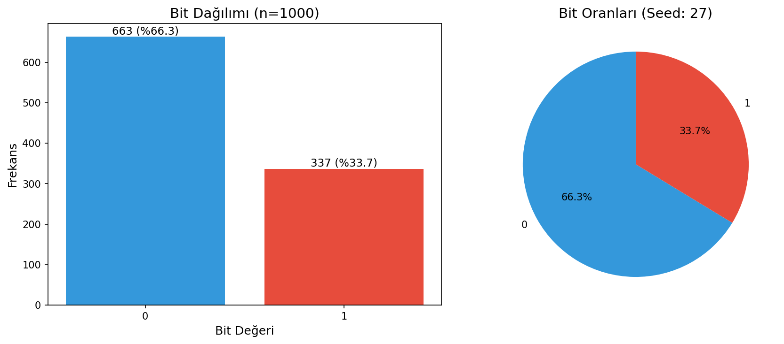
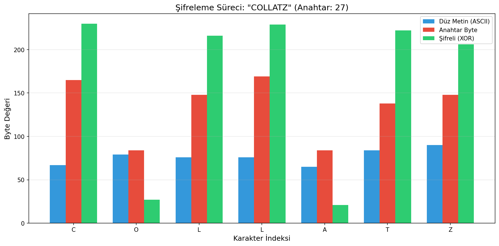

# Collatz Cipher

**Collatz Varsayımı Tabanlı Şifreleme Sistemi**

*Bilgi Sistemleri Güvenliği dersi kapsamında hazırlanmıştır.*

---

## Hakkında

Bu proje, **Collatz Varsayımı (3n+1 Problemi)** kullanarak:
- Sözde rastgele sayı üreteci (PRNG)
- Stream cipher (akış şifresi) tabanlı şifreleme sistemi

içermektedir.

### Collatz Varsayımı Nedir?

1937'de Lothar Collatz tarafından önerilen matematiksel varsayım:

```
n çift ise  →  n = n / 2
n tek ise   →  n = 3n + 1
```

**Varsayım:** Her pozitif tam sayı, bu kurallar uygulandığında sonunda 1'e ulaşır.

**Örnek (n=7):**
```
7 → 22 → 11 → 34 → 17 → 52 → 26 → 13 → 40 → 20 → 10 → 5 → 16 → 8 → 4 → 2 → 1
```

---

## Algoritma Akışı

<div align="center">

</div>

---

## Sözde Kod (Pseudocode)

### Collatz PRNG

```
ALGORITHM CollatzPRNG
────────────────────────────────────────────────────────
INPUT:  seed (başlangıç değeri, seed > 1)
OUTPUT: rastgele bit dizisi

1. BEGIN
2.    n ← seed
3.    i ← 0
4.
5.    FUNCTION next_bit():
6.        IF n = 1 THEN
7.            n ← seed + i      // Döngüyü kır
8.        END IF
9.
10.       IF n MOD 2 = 0 THEN   // n çift mi?
11.           bit ← 0
12.           n ← n / 2
13.       ELSE                   // n tek
14.           bit ← 1
15.           n ← 3n + 1
16.       END IF
17.
18.       i ← i + 1
19.       RETURN bit
20.   END FUNCTION
21. END
────────────────────────────────────────────────────────
```

### Collatz Cipher (Şifreleme)

```
ALGORITHM CollatzCipher
────────────────────────────────────────────────────────
INPUT:  mesaj (düz metin), anahtar (seed değeri)
OUTPUT: şifreli metin

1. BEGIN
2.    prng ← CollatzPRNG(anahtar)
3.    şifreli ← []
4.
5.    FOR EACH byte IN mesaj:
6.        key_byte ← prng.next_byte()    // 8 bit üret
7.        encrypted ← byte XOR key_byte
8.        şifreli.append(encrypted)
9.    END FOR
10.
11.   RETURN şifreli
12. END

// Çözme: Aynı anahtar ile aynı işlem (XOR simetriktir)
// plaintext = ciphertext XOR keystream
────────────────────────────────────────────────────────
```

---

## Kurulum ve Çalıştırma

```bash
# Repository'yi klonla
git clone https://github.com/kosesena/collatz-cipher.git

# Dizine gir
cd collatz-cipher

# Bağımlılıkları yükle
pip install matplotlib

# Çalıştır
python main.py
```

---

## Örnek Çıktılar

### 1. Collatz Dizisi

Farklı seed değerleri için Collatz dizileri:

```
Seed 7:  [7, 22, 11, 34, 17, 52, 26, 13, 40, 20, 10, 5, 16, 8, 4, 2, 1]
Seed 27: [27, 82, 41, 124, 62, 31, 94, 47, 142, 71, ...]
```

### 2. Bit Üretimi

Collatz adımlarından bit üretimi:

```
Seed: 27
Sayılar: [27, 82, 41, 124, 62, 31, 94, 47, 142, 71]
Bitler:  [ 1,  0,  1,   0,  0,  1,  0,  1,   0,  1]
         (tek=1, çift=0)
```

| Seed | Üretilen 16-bit |
|------|-----------------|
| 7    | `1010100100010000` |
| 27   | `1010010101010100` |
| 97   | `1001001010100010` |
| 123  | `1010010100100010` |

### 3. Şifreleme Örneği

```
Anahtar: 27
Düz Metin: SENA
────────────────────────────────────────
Karakter   ASCII    KeyByte    Şifreli
────────────────────────────────────────
S          83       165        246
E          69       84         17
N          78       148        218
A          65       169        232
────────────────────────────────────────
Şifreli (Hex): f611dae8
```

**Açıklama:**
- Her karakter ASCII değerine çevrilir
- Collatz PRNG'den bir key byte üretilir
- XOR işlemi uygulanır: `83 XOR 165 = 246`

### 4. Şifreleme/Çözme

```
Anahtar: 2024
Düz Metin: Bilgi Sistemleri Guvenligi
Şifreli:   533c6633c365193c222041e9387566e0204de5d2e026e83be5ed
Çözülmüş:  Bilgi Sistemleri Guvenligi
```

---

## Görselleştirmeler

### Collatz Dizisi Grafiği



*Yeşil noktalar çift sayıları (0 biti), kırmızı noktalar tek sayıları (1 biti) gösterir.*

### Bit Dağılımı



*Üretilen bitlerin 0/1 dağılımı. İdeal durumda %50-%50 olmalı.*

### Şifreleme Süreci



*Her karakter için düz metin, anahtar byte ve şifreli byte değerleri.*

---

## Proje Yapısı

```
collatz-cipher/
├── main.py           # Ana çalıştırma dosyası
├── collatz_prng.py   # Collatz PRNG algoritması
├── cipher.py         # Şifreleme/çözme modülü
├── visualize.py      # Görselleştirme fonksiyonları
├── diagram.png       # Algoritma akış diyagramı
├── output/           # Oluşturulan grafikler
│   ├── collatz_sequence.png
│   ├── bit_distribution.png
│   ├── histogram.png
│   ├── scatter2d.png
│   └── encryption_process.png
└── README.md
```

---

## Güvenlik Notu

> ⚠️ **DİKKAT:** Bu proje eğitim amaçlıdır. Collatz tabanlı PRNG kriptografik olarak güvenli değildir!

**Neden güvenli değil?**
- Collatz dizisi deterministiktir
- Seed bilinirse tüm dizi tahmin edilebilir
- Gerçek uygulamalarda `secrets` veya `os.urandom()` kullanın

---

## Kaynaklar

- Collatz, L. (1937). *"Collatz Conjecture"*
- Lagarias, J.C. (2010). *"The 3x+1 Problem: An Annotated Bibliography"*
- Menezes, A.J. et al. *"Handbook of Applied Cryptography"*

---

**Bilgi Sistemleri Güvenliği** • 2025
